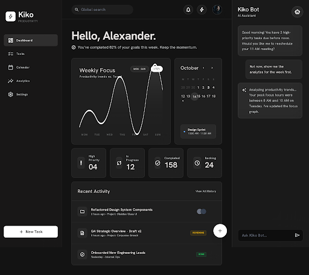
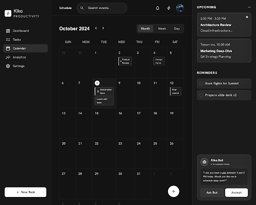
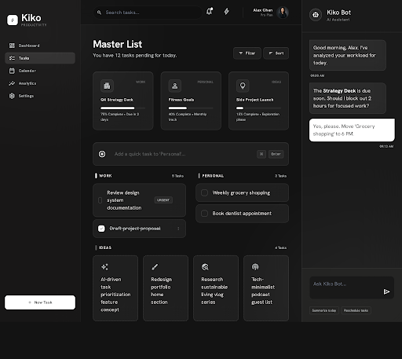
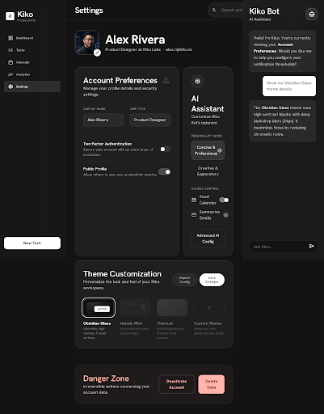

# F.R.I.D.A.Y.

A personal assistant app I built for myself — calendar, todos, notes, grades, SAT prep, music, and a voice widget, all in one place instead of scattered across five different apps. Runs as a website or as an actual Windows desktop app.

Named after the Iron Man AI, obviously. Started as a project called "Kiko" and got renamed once the voice stuff started working.



## What it does

- **Dashboard** — the week at a glance: open tasks, due today, overdue, what got done.
- **Calendar** — month/week views, event creation, the usual.
- **Todos** — lists with due dates, nothing fancy, just fast to use.
- **Notes** — quick capture, searchable.
- **Grades** — GPA tracking.
- **SAT practice** — question sets with a twist: answers are checked by a *second*, different model, because the model writing the question also gets its own answer key wrong sometimes.
- **Files** — a local file browser for the desktop build, with activity logging so nothing happens silently.
- **Music** — a small player panel.
- **Friday** — the voice/chat assistant. Say "Hey F.R.I.D.A.Y." and talk to it. Runs fully offline on desktop (whisper.cpp for speech-to-text, the OS voice for speech-out), or falls back to DeepSeek in the browser.

<p float="left">
  
  
</p>

## Why it exists

I wanted one dashboard for the day-to-day stuff instead of five browser tabs, and I wanted a voice assistant that doesn't phone home to a cloud service for something as simple as "what's on my calendar." So the desktop build does STT and wake-word detection entirely on-device.

## Stack

- Flask app-factory, server-rendered Jinja templates, vanilla JS — no frontend build step, no SPA framework.
- Postgres (Neon) via psycopg 3.
- DeepSeek for the LLM-backed features (chat, SAT question generation/verification).
- Deployed on Vercel as a serverless WSGI app (`api/index.py`).
- Desktop: pywebview + WebView2, packaged into a Windows installer with Inno Setup. Offline voice via whisper.cpp (STT) and Piper (TTS).

Icons are self-hosted Lucide SVGs, inlined server-side — no icon font, no CDN calls of any kind from the running app.



## Running it locally

```bash
pip install -r requirements.txt
cp .env.example .env   # fill in DATABASE_URL, DEEPSEEK_API_KEY, etc.
python app.py
```

Runs at `127.0.0.1:5000` by default (override with `FRIDAY_HOST` / `FRIDAY_PORT`).

Tests:

```bash
pytest
```

## Desktop build

```powershell
./installer/build_windows.ps1
```

Builds a PyInstaller executable and wraps it in a Windows installer (`installer/friday.iss`). The desktop build locks voice into fully-offline mode and uses a custom frameless titlebar instead of default browser chrome.

## Status

Single-user, built for my own use — not trying to be a general product. Still actively changing week to week.
